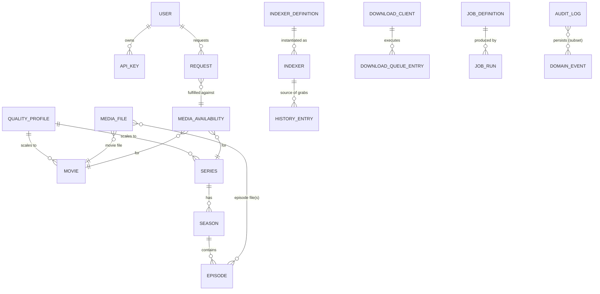

# MediaNexus — Unified Domain Model

> This document is the canonical description of the MediaNexus data/domain model. The concrete Drizzle schema (20 tables,
> SQLite dialect) lives in `packages/database/src/schema.ts`; this document is the source from which that schema is derived. Entities marked
> **implemented** exist in the current schema; the rest are planned and tracked in
> [docs/implementation/roadmap.md](../implementation/roadmap.md).

## 1. Design goals

- **One model, not four schemas.** Movie and TV acquisition share infrastructure (quality profiles, files, downloads,
  indexers, history); where behavior genuinely differs, the model keeps distinct tables/columns.
- **Polymorphic associations via `mediaType` (`movie`|`series`|`episode`).** Releases, history, requests, files and
  media-server state reference *any* media kind through `(mediaType, mediaId)` — the pattern the four upstream apps each
  re-invented separately. This keeps one history list, one queue, one request model for all content without forcing a
  single fat `media` table.
- **No forced abstraction.** Movies and series remain their own tables because their identity, metadata and import
  behavior differ (TMDB vs TVDB, one file vs many episode files). We do **not** collapse them into one table just to look
  unified.
- **The Seerr "media availability" notion is elevated to a first-class concept** (`media_availability`): a movie/series as
  it exists in a user's library server, which is what request fulfillment and "available" statuses depend on.

## 2. Upstream entity mapping

| Upstream concept | Source project(s) | MediaNexus entity |
|---|---|---|
| `Series`, `Season`, `Episode`, `EpisodeFile` | Sonarr | `series`, `season`, `episode`, `media_file` |
| `Movie`, `MovieFile` | Radarr | `movie`, `media_file` |
| `Quality`, `QualityProfile` | Sonarr/Radarr | `quality_profile` (shared by movies + series) |
| `NamingConfig`, `RenameConfig` | Sonarr/Radarr | `setting` entries (namespaced) |
| `Indexer` + Cardigann defs, `IndexerStatus`, proxies, history | Prowlarr | `indexer_definition`, `indexer`, `indexer_category`, `history_entry` |
| `DownloadClient`, `RemotePathMapping` | Sonarr/Radarr/Prowlarr | `download_client`, `setting` (remote path mappings) |
| `Queue`, `History`, `Blocklist`, `Wanted` | Sonarr/Radarr | `download_queue_entry`, `history_entry`, `blocklist_entry` |
| `User`, `UserSettings`, `Media`, `Request`, `RequestItem`, `Watchlist`, `Blocklist` (content prefs) | Seerr | `user`, `user_settings`, `media_availability`, `request`, `request_item`, `watchlist`, `user_content_blocklist` |
| `NotificationAgent`-ish config | all | `notification_provider` |
| auth, `ApiKey` | _arr | `user`, `api_key` |
| scheduled tasks | all | `job_definition`, `job_run` |
| `System/Logs/Health` | all | `health_check_run` (via jobs), `audit_log` |

The _arr `Blocklist` (releases you never want) and Seerr `Blocklist` (content the user doesn't want to see) both legitimately
exist but are **different concepts**; the unified model names them `blocklist_entry` (release-level) and
`user_content_blocklist` (user content preference) to keep them unambiguous.

## 3. Entity catalog

### 3.1 Identity & access

- **`user`** *(implemented)* — `id, username (unique), email, passwordHash, isAdmin, roles (text[]), avatarUrl,
  plexToken, jellyfinToken, created/updated`. Roles seed the Seerr-compatible permission model
  (`ADMIN`, `MODERATOR`, `USER`); fine-grained permissions live in `user_settings.permissions` (JSON) as a plan.
- **`api_key`** *(implemented)* — `id, userId (nullable→system), name, keyHash (sha256), scopes (text[]), lastUsedAt,
  expiresAt, createdAt`. Only the hash is stored; the raw key is shown once at creation. API keys may be user-scoped
  (Seerr-style) or global (system automation, _arr-style).
- **`user_settings`** *(planned)* — per-user prefs mirroring Seerr: locale, region, permissions map, notification prefs.

### 3.2 Configuration

- **`setting`** *(implemented)* — `key (PK), value (json), updatedAt`. Global config: root folders, naming templates,
  download paths, remote-path mappings, timezone, UI prefs. A namespaced key convention (`media.naming`, `paths.root`,
  `system.timezone`, `ui.theme`) keeps JSON flexibility without a rigid column-per-setting shape.
- **`quality_profile`** *(implemented, shared by movies and series)* — `id, name, allowedQualities (json), cutoffQuality,
  formatScore stuff (json), upgradeAllowed, minFormatScore, cutoffFormatScore, language (json), isDefault`. Replaces
  per-app profiles with one table and per-title `qualityProfileId`.

### 3.3 Media

- **`movie`** *(implemented)* — `id, tmdbId, imdbId, title, originalTitle, overview, status, releaseDate, monitored,
  qualityProfileId (FK), rootFolderPath, minimumAvailability, genres (json), images (json), tags (json), addedAt,
  updatedAt, hasFile, movieFileId?`.
- **`series`** *(implemented)* — `id, tvdbId, imdbId, title, overview, status, network, firstAirYear, monitored,
  qualityProfileId (FK), rootFolderPath, seriesType (standard|daily|anime), genres, images, tags, addedAt, updatedAt`.
- **`season`** *(implemented)* — `id, seriesId (FK), seasonNumber, monitored, qualityProfileId?, releaseStatus?`.
- **`episode`** *(implemented)* — `id, seriesId (FK), seasonId (FK), episodeNumber, absoluteNumber, title, overview,
  airDateUtc, monitored, hasFile, sceneSeasonNumber, sceneEpisodeNumber`.
- **`media_file`** *(implemented)* — one table for movies and episodes: `id, mediaType, mediaId, relativePath, size,
  quality (json), edition, dateAdded, mediaInfo (video/audio json), languages (json), isSample`. Episodes link via
  `episode_ids` (a file can contain several episodes, e.g. multi-episode packs).
- **`collection`** *(planned)* — `id, tmdbId, name, overview, images, movies (via join table)`.
- **`genre`** *(planned)* and **`person`**/**`person_credit`** *(planned)* — TMDB/TVDB-backed people and credits
  (`mediaType, mediaId, personId, role, character, order`), shared across movies and series.
- **`media_image`** *(planned)* — `mediaType, mediaId, coverType (poster|fanart|logo…), remoteUrl, localPath` so artwork
  can be cached locally.

### 3.4 Discovery (indexers)

- **`indexer_definition`** *(implemented)* — read-only catalog of known indexers: `id, key, name, protocol
  (usenet|torrent|both), implementation, capabilities (json), categoryIds (json), cardigannYml (nullable), builtIn`. Populated
  from seeds (a few canonical Newznab/Torznab definitions) with Cardigann YAML support flagged as a plan.
- **`indexer`** *(implemented)* — a configured instance: `id, definitionKey, name, protocol, enabled, implementation,
  settings (json: url/apikey/user/pass/categories/seedRatio…), proxy (json), priority, downloadClientId?, tags,
  status (ok|error|disabled), lastError, lastSyncAt, created/updated`.
- **`indexer_category`** *(planned)* — indexer-specific Newznab/Torznab category trees (`indexerId, newznabId, name,
  parent`).

### 3.5 Acquisition

- **`download_client`** *(implemented* — schema only, no providers yet*)* — `id, name, implementation, enabled,
  settings (json), priority, tags`. Implementation string names the registered provider (e.g. `sabnzbd`,
  `qbittorrent`); settings are validated against the provider's zod schema (see `integrations`).
- **`download_queue_entry`** *(implemented)* — live queue mirror: `id, mediaType, mediaId, downloadClientId,
  downloadId (client-side id), title, status (queued|downloading|paused|completed|failed|imported|…), progress, size,
  remainingTime, errorMessage, addedAt`.
- **`history_entry`** *(implemented)* — append-only activity: `id, mediaType, mediaId, action
  (grabbed|downloadCompleted|importCompleted|upgraded|failed|releaseMissing|…), data (json: release title, quality,
  indexer, client, downloadId, source), createdAt`. This is the unified History view for movies and series.
- **`blocklist_entry`** *(implemented* — schema only*)* — `id, mediaType, mediaId, indexerId?, title, torrentInfohash,
  reason, createdAt` (the _arr release blocklist).
- **`release`** *(planned, search result model — not persisted, a DTO)* — normalized search result: `indexerId, title,
  protocol, categories, size, seeders/leechers/peers, downloadUrl, magnetUrl, infoUrl, guid, quality, language, isFreelee,
  isProper, repack, age, grabAllowed`. This is the native contract for Searches; see `api.md`.

### 3.6 Requests (Seerr parity)

- **`media_availability`** *(implemented)* — "this movie/series exists in a media server": `id, mediaType, mediaId,
  status (unknown|processing|partiallyAvailable|available), plexId?, jellyfinId?, tmdbRating, tmdbVoteCount, lastTmdbSyncAt,
  lastAvailabilitySyncAt`. Request fulfillment reads this; availability watchers update it.
- **`request`** *(implemented)* — `id, userRequestorId (FK), mediaType, mediaId, status
  (pending|approved|declined|processing|fulfilled|failed|expired|…), requestedAt, updatedAt, adminNote?, isAutoApproval,
  is4k? `.
- **`request_item`** *(planned)* — per-season/per-episode granularity for series requests (`requestId, seriesId,
  seasonNumber, episodeNumbers, status`).
- **`watchlist`** *(planned)* and **`user_content_blocklist`** *(planned)* — user content prefs from Seerr.

### 3.7 Automation & jobs

- **`job_definition`** *(implemented)* — `id, key (unique), name, description, schedule (cron), enabled, timeoutMs,
  maxRetries, retryBackoffMs, priority, concurrencyLimit, createdAt`. Seeds: `system.healthCheck`, `system.metadataCleanup`,
  `discovery.indexerRefresh` (later), `media.rssSync` (later).
- **`job_run`** *(implemented)* — `id, jobKey, status (queued|running|succeeded|failed|cancelled|retrying), trigger
  (scheduled|manual|event), attempt, progress (0-100), message, error, startedAt, finishedAt, payload (json), result (json)`
  — the persisted job history requested by the brief.

### 3.8 Notifications & observability

- **`notification_provider`** *(planned — schema drafted)* — `id, name, implementation, enabled, settings (json), eventTypes
  (text[]), tags, created/updated`. Event subscriptions are explicit so future notification sinks receive only relevant
  domain events.
- **`audit_log`** *(implemented)* — `id, correlationId, actor (user id | 'system'), action, entityType, entityId,
  details (json), ip, createdAt`. Every security-relevant or admin action is recorded (Rule 7/observability).

## 4. Relationships (subset)

Polymorphic FKs (`mediaType` + `mediaId`) apply to `media_file`, `download_queue_entry`, `history_entry`,
`blocklist_entry`, `media_availability`, `request`. A database-level polymorphic FK is not enforced (SQLite/PG both lack
native polymorphism); referential integrity is enforced at the service layer plus a check on `mediaType` values.

## 5. Terminology decisions

| Term | Meaning |
|---|---|
| `mediaType` | `movie` \| `series` \| `episode` (episode is only ever the *subject* of a file/history/queue row; requests are movie/series granularity) |
| Grab | a release chosen from search results and sent to a download client |
| Import | verified + quality-checked download moved into the media library (hardlink/copy/rename) |
| Availability | whether content exists in a connected media server (Seerr concept) |
| Release blocklist vs content blocklist | _arr (releases) vs Seerr (content prefs) — kept distinct |
| `quality` | the quality-resolution + source (e.g. `Bluray-1080p`) normalization shared across movies/series |
